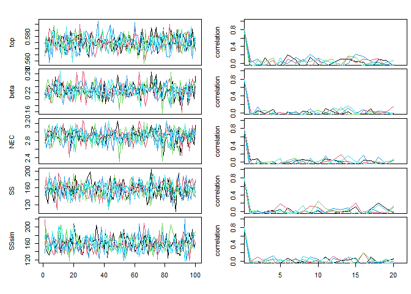
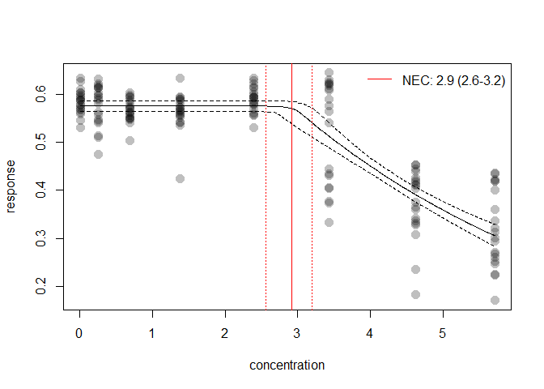
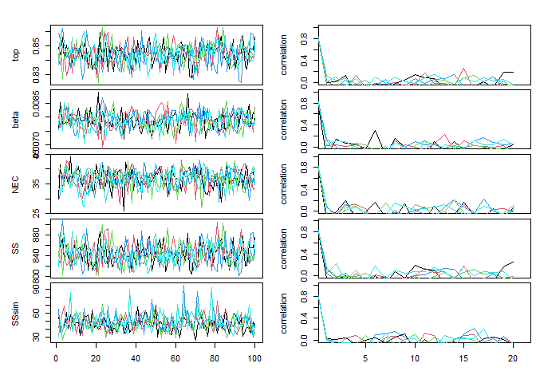
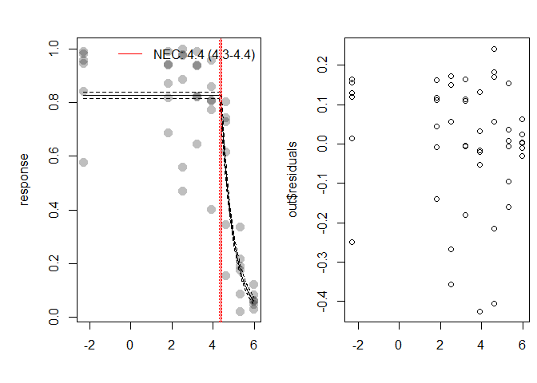
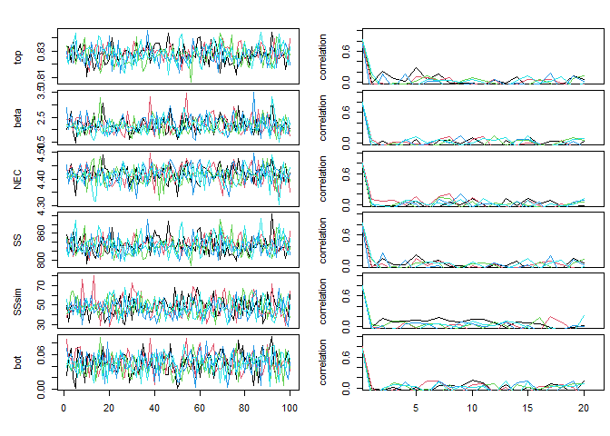
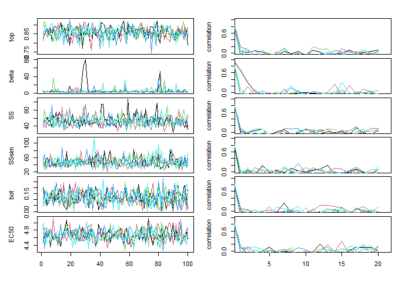
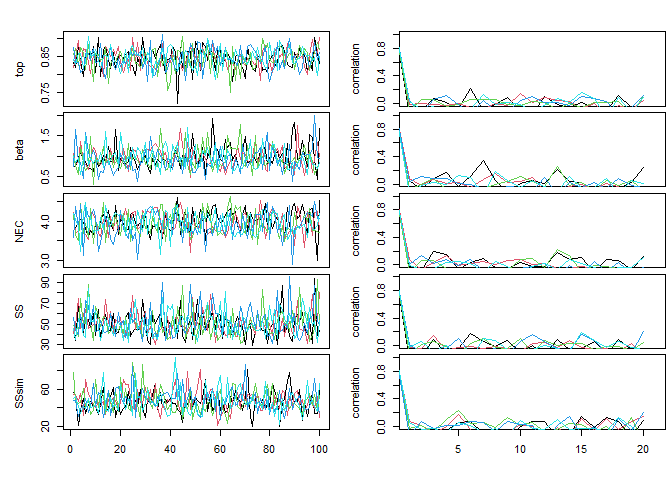

<!-- README.md is generated from README.Rmd. Please edit that file -->

jagsNEC
=======

‘jagsNEC’ is an R package to fit concentration(dose) - response curves
to toxicity data, and derive No-Effect-Concentration (NEC),
No-Significant-Effect-Concentration (NSEC), and Effect-Concentration (of
specified percentage ‘x’, ECx) thresholds from non-linear models fitted
using Bayesian MCMC fitting methods via the R2jags package and jags.

Background
==========

Bayesian model fitting can be difficult to automate across a broad range
of usage cases, particularly with respect to specifying valid initial
values and appropriate priors. This is one reason the use of Bayesian
statistics for NEC estimation (or even ECx estimmation) is not currently
widely adopted across the broader ecotoxicological community, who rarely
have access to specialist statistical expertise. The jagsNEC package
attempts to provide an accessible interface to the R2jags package
specifically for fitting NEC models and other concentration-response
models, with a range of models specified based on the known distribution
of the “concentration” or “dose” variable (the predictor, x) as well as
the “response” (y) variable. The model formula, including priors and the
required init function required to call a jags model are automatically
generated based on information contained in the supplied data. While the
distribution of the x and y variables can be specified directly, jagsNEC
will automatically ‘guess’ the correct distribution to use, based on the
characteristics of the provided data.

This project started with an implementation of the NEC model based on
that described in (Fox 2010). The package has been further generalised
to allow a large range of response variables to be modelled using the
appropriate statistical distribution, and the current implementation
supports gaussian, poisson, binomial, gamma, negbin and beta response
data. We have since also further added a range of alternative NEC model
types, as well as a range of typically used concentration-response
models (such as 4-parameter logistic and weibull models) that have no
NEC ‘step’ function but simply model response as a smooth function of
concentration.

Models can be fit directly using fit.jagsNEC, or alternatively using the
function fit.jagsMANEC it is possible to fit a specific set or all of
the available models. The fit.jagsMANEC function returns a model
weighted estimate of predicted posterior values, based on DIC model
weights. It is also possible to obtain all individual model fits from
the fitted jagsMANECfit model object if required.

An additional endpoint has also been derived using Bayesian posterior
predicted values to estimate the “No-Statistical-Effect-Concentration”
as the concentration at which predicted values for each MCMC chain fall
below a lower percentile bound (defined as sig.val) of the control,
which is assumed to be the lowest treatment (x.var) concentration in the
data. NSEC estimates are currently used to approximate NEC for models
without a specific NEC step parameter (in jagsNEC these have the prefix
ECx in their model name).

Important information on the current package is contained in the jagsNEC
and jagsMANEC helpfiles (see ?jagsNEC).

This package is currently under development. We are keen on any feedback
regarding usage, and especially bug reporting that includes an easy self
contained reproducible example of either unexpected behaviour or example
model fits that fail to converge (have poor chain mixing) or yield other
errors. Such information will hopefully help us towards building a more
robust package. We cannot help troublshoot issues if an easy to run
reproducible example is not supplied.

Installation
============

To install the latest version from github
(<a href="https://github.com/AIMS/NEC-estimation" class="uri">https://github.com/AIMS/NEC-estimation</a>)
use:

    install.packages("remotes")
    remotes::install_github("AIMS/NEC-estimation")

Examples
========

Fitting the NEC3param model using fit.jagsNEC
---------------------------------------------

Here we include some examples showing how to use the package to fit an
NEC model to binomial, proportional, count and continuous response (y)
data. The examples are those used by Gerard Ricardo at:
<a href="https://github.com/gerard-ricardo/NECs/blob/master/NECs" class="uri">https://github.com/gerard-ricardo/NECs/blob/master/NECs</a>.
Here we show how to run the same jags models using the jagsNEC package.

### Binomial data

Where data are a count out of a total (such as the percentage survival
of individuals, for example) y is binomial. First we read in the
binomial example from pastebin, and then plot the “concentration” or x
data, in this case raw.x.

    binom.data <- read.table("https://pastebin.com/raw/zfrUha88", header = TRUE, dec = ",")
    str(binom.data)
    #> 'data.frame':    48 obs. of  3 variables:
    #>  $ raw.x: chr  "0.1" "0.1" "0.1" "0.1" ...
    #>  $ suc  : int  101 106 102 112 58 158 95 91 93 113 ...
    #>  $ tot  : int  175 112 103 114 69 165 109 92 99 138 ...
    binom.data$raw.x <- as.numeric(as.character(binom.data$raw.x))
    range(binom.data$raw.x)
    #> [1]   0.1 400.0
    par(mfrow = c(2, 1))
    hist(binom.data$raw.x)
    hist(binom.data$suc / binom.data$tot)

In this case for x, lowest concentration is 0.1 and the highest is 400.
The data are right skewed and on the continuous scale. This type of
distribution for the x data are common for concentration response
experiments, where the x “concentration” data are the concentration of
contaminants, or dilutions. In general we can model x as gamma. The
current default in jagsNEC is to estimate the appropriate distribution
for both the *y.type* and *x.type* arguments, but it is possible to
supply these arguments directly.

The data are clearly binomial, with the header “suc” - indicating the
number of ‘successes’ in the binomial call, with ‘tot’ clearly
indicating the number of trials.

The main ‘working’ function in jagsNEC is the function fit.jagsNEC,
which calls the other necessary functions and fits the jags model. See
?fit.jagsNEC for more details. We run fit.jagsNEC by supplying *data* -
a data.frame containing the data for the model fitting, here,
binom.data; *x.var* - the name of the column in *data* which contains
the concentration data or ‘x’ data to be used in the NEC model fit, and
*y.var* - the name of the column in *data* which contains the response
or ‘y’ data to be used in the NEC model fit. In our example here, as
this is binomial, we must also supply *trials.var*, which is the name of
the column in *data* which contains the number of trials in the binomial
call.

fit.jagsNEC sill guess the data types for use, although we could specify
*y.type* as “binomial” and *x.type* as “gamma”. This example fits
without specifying either, but trials.var must be supplied.

    set.seed(333)
    out <- fit.jagsNEC(
      data = binom.data,
      x.var = "raw.x",
      y.var = "suc",
      trials.var = "tot"
    )
    #> Compiling model graph
    #>    Resolving undeclared variables
    #>    Allocating nodes
    #> Graph information:
    #>    Observed stochastic nodes: 48
    #>    Unobserved stochastic nodes: 51
    #>    Total graph size: 685
    #> 
    #> Initializing model
    #> 
    #>   |                                                          |                                                  |   0%  |                                                          |*                                                 |   2%  |                                                          |**                                                |   4%  |                                                          |***                                               |   6%  |                                                          |****                                              |   8%  |                                                          |*****                                             |  10%  |                                                          |******                                            |  12%  |                                                          |*******                                           |  14%  |                                                          |********                                          |  16%  |                                                          |*********                                         |  18%  |                                                          |**********                                        |  20%  |                                                          |***********                                       |  22%  |                                                          |************                                      |  24%  |                                                          |*************                                     |  26%  |                                                          |**************                                    |  28%  |                                                          |***************                                   |  30%  |                                                          |****************                                  |  32%  |                                                          |*****************                                 |  34%  |                                                          |******************                                |  36%  |                                                          |*******************                               |  38%  |                                                          |********************                              |  40%  |                                                          |*********************                             |  42%  |                                                          |**********************                            |  44%  |                                                          |***********************                           |  46%  |                                                          |************************                          |  48%  |                                                          |*************************                         |  50%  |                                                          |**************************                        |  52%  |                                                          |***************************                       |  54%  |                                                          |****************************                      |  56%  |                                                          |*****************************                     |  58%  |                                                          |******************************                    |  60%  |                                                          |*******************************                   |  62%  |                                                          |********************************                  |  64%  |                                                          |*********************************                 |  66%  |                                                          |**********************************                |  68%  |                                                          |***********************************               |  70%  |                                                          |************************************              |  72%  |                                                          |*************************************             |  74%  |                                                          |**************************************            |  76%  |                                                          |***************************************           |  78%  |                                                          |****************************************          |  80%  |                                                          |*****************************************         |  82%  |                                                          |******************************************        |  84%  |                                                          |*******************************************       |  86%  |                                                          |********************************************      |  88%  |                                                          |*********************************************     |  90%  |                                                          |**********************************************    |  92%  |                                                          |***********************************************   |  94%  |                                                          |************************************************  |  96%  |                                                          |************************************************* |  98%  |                                                          |**************************************************| 100%
    #> Response variable suc modelled using a binomial distribution.

The function shows the progress of the jags fit and returns the usual
jags output (with a few other additions to this list). The function
*check.chains* can be used to plot the chains and the chain ACF, so we
can assess mixing and looks for other potential issues with the model
fit. Initially jagsNEC will attempt to use starting values generated by
the init function that we have specified for that type of model fit. It
will run a small number of iterations and then test for good mixing. If
the model fails to fit or the mixing is not very good (among chain
variance is a lot bigger than within chain variance) jagsNEC with try up
to *n.tries* more times to fit the data using the generated *init*
function to try and obtain a successfuly fitted model with good mixing.
If this still fails to yield a successful and/or well mixed model,
jagsNEC will try up to *n.tries* more times using the default initial
values as generated by R2jags. If no model is successfully fit an error
will be returned indicating the model could not be fit succesfully. If a
model is fit but still has poor mixing even after *n.tries* attempts,
the model with the best mixing will be returned, with a warning to
cautiously interpret the results and inspect the chain mixing diagnostic
plot.

    check.chains(out)

In our example, the chains are well mixed and our ACF plot looks good,
so we can go ahead and interpret this model.

The function *plot* can be used to plot the fitted model. Alternatively
you can make your own plot from the data included in the returned list
from the call to fit.jagsNEC. In this example, this could be extracted
using *out$pred.vals*

    par(mfrow = c(1, 1))
    plot(out)

### Beta data

Sometimes the response variable is distributed between *0* and *1* but
is not a straight forward binomial. A common example in coral ecology is
maximum quantum yield (the proportion of light used for photosynthesis
when all reaction centres are open) which is a measure of photosynthetic
efficiency calculated from PAM data. Here we have a proportion value
that is not based on trials and successes. In this case there are no
theoretical ‘trials’ and the data must be modelled using a beta
distribution.

    require(tidyverse)
    #> Loading required package: tidyverse
    #> -- Attaching packages --------------------------------------- tidyverse 1.3.0 --
    #> v ggplot2 3.3.1     v purrr   0.3.4
    #> v tibble  3.0.1     v dplyr   1.0.0
    #> v tidyr   1.1.0     v stringr 1.4.0
    #> v readr   1.3.1     v forcats 0.5.0
    #> -- Conflicts ------------------------------------------ tidyverse_conflicts() --
    #> x dplyr::filter()  masks stats::filter()
    #> x purrr::flatten() masks R.rsp::flatten()
    #> x dplyr::lag()     masks stats::lag()
    #> x tibble::view()   masks R.rsp::view()
    prop.data <- read.table("https://pastebin.com/raw/123jq46d", header = TRUE, dec = ",") %>%
      mutate(
        raw.x = log(as.numeric(as.character(raw.x)) + 1),
        resp = as.numeric(as.character(resp))
      )
    set.seed(333)
    out <- fit.jagsNEC(
      data = prop.data,
      x.var = "raw.x",
      y.var = "resp",
      n.tries = 1
    )
    #> Compiling model graph
    #>    Resolving undeclared variables
    #>    Allocating nodes
    #> Graph information:
    #>    Observed stochastic nodes: 160
    #>    Unobserved stochastic nodes: 164
    #>    Total graph size: 1545
    #> 
    #> Initializing model
    #> Deleting model
    #> 
    #> Compiling model graph
    #>    Resolving undeclared variables
    #>    Allocating nodes
    #> Graph information:
    #>    Observed stochastic nodes: 160
    #>    Unobserved stochastic nodes: 164
    #>    Total graph size: 1545
    #> 
    #> Initializing model
    #> Deleting model
    #> 
    #> Compiling model graph
    #>    Resolving undeclared variables
    #>    Allocating nodes
    #> Graph information:
    #>    Observed stochastic nodes: 160
    #>    Unobserved stochastic nodes: 164
    #>    Total graph size: 1545
    #> 
    #> Initializing model
    #> 
    #>   |                                                          |                                                  |   0%  |                                                          |*                                                 |   2%  |                                                          |**                                                |   4%  |                                                          |***                                               |   6%  |                                                          |****                                              |   8%  |                                                          |*****                                             |  10%  |                                                          |******                                            |  12%  |                                                          |*******                                           |  14%  |                                                          |********                                          |  16%  |                                                          |*********                                         |  18%  |                                                          |**********                                        |  20%  |                                                          |***********                                       |  22%  |                                                          |************                                      |  24%  |                                                          |*************                                     |  26%  |                                                          |**************                                    |  28%  |                                                          |***************                                   |  30%  |                                                          |****************                                  |  32%  |                                                          |*****************                                 |  34%  |                                                          |******************                                |  36%  |                                                          |*******************                               |  38%  |                                                          |********************                              |  40%  |                                                          |*********************                             |  42%  |                                                          |**********************                            |  44%  |                                                          |***********************                           |  46%  |                                                          |************************                          |  48%  |                                                          |*************************                         |  50%  |                                                          |**************************                        |  52%  |                                                          |***************************                       |  54%  |                                                          |****************************                      |  56%  |                                                          |*****************************                     |  58%  |                                                          |******************************                    |  60%  |                                                          |*******************************                   |  62%  |                                                          |********************************                  |  64%  |                                                          |*********************************                 |  66%  |                                                          |**********************************                |  68%  |                                                          |***********************************               |  70%  |                                                          |************************************              |  72%  |                                                          |*************************************             |  74%  |                                                          |**************************************            |  76%  |                                                          |***************************************           |  78%  |                                                          |****************************************          |  80%  |                                                          |*****************************************         |  82%  |                                                          |******************************************        |  84%  |                                                          |*******************************************       |  86%  |                                                          |********************************************      |  88%  |                                                          |*********************************************     |  90%  |                                                          |**********************************************    |  92%  |                                                          |***********************************************   |  94%  |                                                          |************************************************  |  96%  |                                                          |************************************************* |  98%  |                                                          |**************************************************| 100%
    #> Response variable resp modelled using a beta distribution.

    check.chains(out)

    par(mfrow = c(1, 1))
    plot(out)

### Poisson data

Where data are a count (of, for example, individuals or cells) y is
poisson. Such data are distributed from *0* to *Inf* and are integers.
First we read in the count data example from pastebin, and then plot the
“concentration” or x data, Again, this is raw.x, and distributed as in
our binomial example above.

    count.data <- read.table("https://pastebin.com/raw/ENgNSgf7", header = TRUE, dec = ",")
    str(count.data)
    #> 'data.frame':    48 obs. of  2 variables:
    #>  $ raw.x: chr  "0.1" "0.1" "0.1" "0.1" ...
    #>  $ count: int  164 100 103 102 102 101 131 102 112 100 ...

    count.data$raw.x <- as.numeric(as.character(count.data$raw.x))

    range(count.data$raw.x)
    #> [1]   0.1 190.0
    par(mfrow = c(2, 1))
    hist(count.data$raw.x)
    hist(count.data$count)

First we supply *fit.jagsNEC* with *data* (count.data), and specify
*x.var* and *y.var*. As we have concentration data, our *x.type* would
be the gamma distribution, and *y.type* is “poisson”. The default
behaviour to guess the variable types works for this example.

    set.seed(333)
    out <- fit.jagsNEC(
      data = count.data,
      x.var = "raw.x",
      y.var = "count"
    )
    #> Compiling model graph
    #>    Resolving undeclared variables
    #>    Allocating nodes
    #> Graph information:
    #>    Observed stochastic nodes: 48
    #>    Unobserved stochastic nodes: 51
    #>    Total graph size: 469
    #> 
    #> Initializing model
    #> 
    #>   |                                                          |                                                  |   0%  |                                                          |*                                                 |   2%  |                                                          |**                                                |   4%  |                                                          |***                                               |   6%  |                                                          |****                                              |   8%  |                                                          |*****                                             |  10%  |                                                          |******                                            |  12%  |                                                          |*******                                           |  14%  |                                                          |********                                          |  16%  |                                                          |*********                                         |  18%  |                                                          |**********                                        |  20%  |                                                          |***********                                       |  22%  |                                                          |************                                      |  24%  |                                                          |*************                                     |  26%  |                                                          |**************                                    |  28%  |                                                          |***************                                   |  30%  |                                                          |****************                                  |  32%  |                                                          |*****************                                 |  34%  |                                                          |******************                                |  36%  |                                                          |*******************                               |  38%  |                                                          |********************                              |  40%  |                                                          |*********************                             |  42%  |                                                          |**********************                            |  44%  |                                                          |***********************                           |  46%  |                                                          |************************                          |  48%  |                                                          |*************************                         |  50%  |                                                          |**************************                        |  52%  |                                                          |***************************                       |  54%  |                                                          |****************************                      |  56%  |                                                          |*****************************                     |  58%  |                                                          |******************************                    |  60%  |                                                          |*******************************                   |  62%  |                                                          |********************************                  |  64%  |                                                          |*********************************                 |  66%  |                                                          |**********************************                |  68%  |                                                          |***********************************               |  70%  |                                                          |************************************              |  72%  |                                                          |*************************************             |  74%  |                                                          |**************************************            |  76%  |                                                          |***************************************           |  78%  |                                                          |****************************************          |  80%  |                                                          |*****************************************         |  82%  |                                                          |******************************************        |  84%  |                                                          |*******************************************       |  86%  |                                                          |********************************************      |  88%  |                                                          |*********************************************     |  90%  |                                                          |**********************************************    |  92%  |                                                          |***********************************************   |  94%  |                                                          |************************************************  |  96%  |                                                          |************************************************* |  98%  |                                                          |**************************************************| 100%
    #> Response variable count modelled using a poisson distribution.

    check.chains(out)

In our example, not all the chains are well mixed and our ACF plot looks
problematic. We should probably not interpret this model. Later we can
explore options for fitting this data better (see Fitted model and model
validation and selection).

    par(mfrow = c(1, 1))
    plot(out)

### Measure data

Where data are a measured variable (ie length or size) y is gamma. Such
data are distributed from *0+* to *Inf* and are continuous. First we
read in the count data example from pastebin, and then plot the
“concentration” or x data, Again, this is raw.x, and distributed as in
our binomial example above.

    measure.data <- read.table("https://pastebin.com/raw/pWeS6x0n", header = TRUE, dec = ",")
    measure.data$raw.x <- as.numeric(as.character(measure.data$raw.x))
    measure.data$measure <- as.numeric(as.character(measure.data$measure))

    set.seed(333)
    out <- fit.jagsNEC(
      data = measure.data,
      x.var = "raw.x",
      y.var = "measure"
    )
    #> Compiling model graph
    #>    Resolving undeclared variables
    #>    Allocating nodes
    #> Graph information:
    #>    Observed stochastic nodes: 48
    #>    Unobserved stochastic nodes: 52
    #>    Total graph size: 526
    #> 
    #> Initializing model
    #> Deleting model
    #> 
    #> Compiling model graph
    #>    Resolving undeclared variables
    #>    Allocating nodes
    #> Graph information:
    #>    Observed stochastic nodes: 48
    #>    Unobserved stochastic nodes: 52
    #>    Total graph size: 526
    #> 
    #> Initializing model
    #> Deleting model
    #> 
    #> Compiling model graph
    #>    Resolving undeclared variables
    #>    Allocating nodes
    #> Graph information:
    #>    Observed stochastic nodes: 48
    #>    Unobserved stochastic nodes: 52
    #>    Total graph size: 526
    #> 
    #> Initializing model
    #> Deleting model
    #> 
    #> Compiling model graph
    #>    Resolving undeclared variables
    #>    Allocating nodes
    #> Graph information:
    #>    Observed stochastic nodes: 48
    #>    Unobserved stochastic nodes: 52
    #>    Total graph size: 526
    #> 
    #> Initializing model
    #> Deleting model
    #> 
    #> Compiling model graph
    #>    Resolving undeclared variables
    #>    Allocating nodes
    #> Graph information:
    #>    Observed stochastic nodes: 48
    #>    Unobserved stochastic nodes: 52
    #>    Total graph size: 526
    #> 
    #> Initializing model
    #> 
    #> Compiling model graph
    #>    Resolving undeclared variables
    #>    Allocating nodes
    #> Graph information:
    #>    Observed stochastic nodes: 48
    #>    Unobserved stochastic nodes: 52
    #>    Total graph size: 526
    #> 
    #> Initializing model
    #> 
    #>   |                                                          |                                                  |   0%  |                                                          |*                                                 |   2%  |                                                          |**                                                |   4%  |                                                          |***                                               |   6%  |                                                          |****                                              |   8%  |                                                          |*****                                             |  10%  |                                                          |******                                            |  12%  |                                                          |*******                                           |  14%  |                                                          |********                                          |  16%  |                                                          |*********                                         |  18%  |                                                          |**********                                        |  20%  |                                                          |***********                                       |  22%  |                                                          |************                                      |  24%  |                                                          |*************                                     |  26%  |                                                          |**************                                    |  28%  |                                                          |***************                                   |  30%  |                                                          |****************                                  |  32%  |                                                          |*****************                                 |  34%  |                                                          |******************                                |  36%  |                                                          |*******************                               |  38%  |                                                          |********************                              |  40%  |                                                          |*********************                             |  42%  |                                                          |**********************                            |  44%  |                                                          |***********************                           |  46%  |                                                          |************************                          |  48%  |                                                          |*************************                         |  50%  |                                                          |**************************                        |  52%  |                                                          |***************************                       |  54%  |                                                          |****************************                      |  56%  |                                                          |*****************************                     |  58%  |                                                          |******************************                    |  60%  |                                                          |*******************************                   |  62%  |                                                          |********************************                  |  64%  |                                                          |*********************************                 |  66%  |                                                          |**********************************                |  68%  |                                                          |***********************************               |  70%  |                                                          |************************************              |  72%  |                                                          |*************************************             |  74%  |                                                          |**************************************            |  76%  |                                                          |***************************************           |  78%  |                                                          |****************************************          |  80%  |                                                          |*****************************************         |  82%  |                                                          |******************************************        |  84%  |                                                          |*******************************************       |  86%  |                                                          |********************************************      |  88%  |                                                          |*********************************************     |  90%  |                                                          |**********************************************    |  92%  |                                                          |***********************************************   |  94%  |                                                          |************************************************  |  96%  |                                                          |************************************************* |  98%  |                                                          |**************************************************| 100%
    #> Response variable measure modelled using a gamma distribution.

    check.chains(out)

The function *plot* can be used to plot the fitted model. The estimated
NEC value can be obtained directly from the fitted model object, using
*out$NEC*. EC*x* estimates can also be obtained from the NEC model fit,
using the function *extract\_ECx*. Note these may differ from a typical
4-parameter non-linear model, as the NEC model is a broken stick
non-linear regression and will often fall more sharply than a smooth
4-parameter non-linear curve.

    par(mfrow = c(1, 1))
    plot(out)

    extract_ECx(out)
    #>    EC_10 EC_10_lw EC_10_up 
    #> 64.32111 53.61632 72.71695

Model validation and selection
------------------------------

To explore some model validation, let us revisit our original binomial
model. While chain mixing for this model is ok, the residual plot does
not look fantastic. Even with good convergence, some model fits may be
poor. This can result in over (the data has greater residual variance
than that generated by the fitted model) and under- dispersion (the data
have less residual variance than that generated by the fitted model).
Generally overdispersion is more common, particularly for binomial and
poisson models, which are single parameter distributions.

    set.seed(333)
    out <- fit.jagsNEC(
      data = binom.data,
      x.var = "raw.x",
      y.var = "suc",
      trials.var = "tot"
    )
    #> Compiling model graph
    #>    Resolving undeclared variables
    #>    Allocating nodes
    #> Graph information:
    #>    Observed stochastic nodes: 48
    #>    Unobserved stochastic nodes: 51
    #>    Total graph size: 685
    #> 
    #> Initializing model
    #> 
    #>   |                                                          |                                                  |   0%  |                                                          |*                                                 |   2%  |                                                          |**                                                |   4%  |                                                          |***                                               |   6%  |                                                          |****                                              |   8%  |                                                          |*****                                             |  10%  |                                                          |******                                            |  12%  |                                                          |*******                                           |  14%  |                                                          |********                                          |  16%  |                                                          |*********                                         |  18%  |                                                          |**********                                        |  20%  |                                                          |***********                                       |  22%  |                                                          |************                                      |  24%  |                                                          |*************                                     |  26%  |                                                          |**************                                    |  28%  |                                                          |***************                                   |  30%  |                                                          |****************                                  |  32%  |                                                          |*****************                                 |  34%  |                                                          |******************                                |  36%  |                                                          |*******************                               |  38%  |                                                          |********************                              |  40%  |                                                          |*********************                             |  42%  |                                                          |**********************                            |  44%  |                                                          |***********************                           |  46%  |                                                          |************************                          |  48%  |                                                          |*************************                         |  50%  |                                                          |**************************                        |  52%  |                                                          |***************************                       |  54%  |                                                          |****************************                      |  56%  |                                                          |*****************************                     |  58%  |                                                          |******************************                    |  60%  |                                                          |*******************************                   |  62%  |                                                          |********************************                  |  64%  |                                                          |*********************************                 |  66%  |                                                          |**********************************                |  68%  |                                                          |***********************************               |  70%  |                                                          |************************************              |  72%  |                                                          |*************************************             |  74%  |                                                          |**************************************            |  76%  |                                                          |***************************************           |  78%  |                                                          |****************************************          |  80%  |                                                          |*****************************************         |  82%  |                                                          |******************************************        |  84%  |                                                          |*******************************************       |  86%  |                                                          |********************************************      |  88%  |                                                          |*********************************************     |  90%  |                                                          |**********************************************    |  92%  |                                                          |***********************************************   |  94%  |                                                          |************************************************  |  96%  |                                                          |************************************************* |  98%  |                                                          |**************************************************| 100%
    #> Response variable suc modelled using a binomial distribution.
    check.chains(out)

    par(mfrow = c(1, 2))
    plot(out)
    plot(binom.data$raw.x, out$residuals)

A test for over or under-dispersion is performed by jagsNEC, and this
can be extracted using *$over.disp*. Values &gt;0.5 indicate
over-dispersion and values &lt;0.5 indicate under-dispersion. Values in
the range 0.22-0.75 are acceptable. In this case the overdispersion
value is 1, indicating quite extreme overdispersion (meaning our model
doesn’t properly capture the true variability represented in this data).
Over and under-dispersion can be due to a poor fitting model, as well as
violation of the distribution assumptions of the fitted data (for
example, when the response data are poisson, the variance should equal
the mean, which is often not the case).

    out$over.disp
    #> [1] 1

First, let’s see if the model fits better using a log transformation of
the x-data, given these appear to have been set on a log scaling anyway
(based on the spacing between the treatment values).

    set.seed(333)
    binom.data$log.x <- log(binom.data$raw.x)
    out <- fit.jagsNEC(
      data = binom.data,
      x.var = "log.x",
      y.var = "suc",
      trials.var = "tot"
    )
    #> Compiling model graph
    #>    Resolving undeclared variables
    #>    Allocating nodes
    #> Graph information:
    #>    Observed stochastic nodes: 48
    #>    Unobserved stochastic nodes: 51
    #>    Total graph size: 686
    #> 
    #> Initializing model
    #> 
    #>   |                                                          |                                                  |   0%  |                                                          |*                                                 |   2%  |                                                          |**                                                |   4%  |                                                          |***                                               |   6%  |                                                          |****                                              |   8%  |                                                          |*****                                             |  10%  |                                                          |******                                            |  12%  |                                                          |*******                                           |  14%  |                                                          |********                                          |  16%  |                                                          |*********                                         |  18%  |                                                          |**********                                        |  20%  |                                                          |***********                                       |  22%  |                                                          |************                                      |  24%  |                                                          |*************                                     |  26%  |                                                          |**************                                    |  28%  |                                                          |***************                                   |  30%  |                                                          |****************                                  |  32%  |                                                          |*****************                                 |  34%  |                                                          |******************                                |  36%  |                                                          |*******************                               |  38%  |                                                          |********************                              |  40%  |                                                          |*********************                             |  42%  |                                                          |**********************                            |  44%  |                                                          |***********************                           |  46%  |                                                          |************************                          |  48%  |                                                          |*************************                         |  50%  |                                                          |**************************                        |  52%  |                                                          |***************************                       |  54%  |                                                          |****************************                      |  56%  |                                                          |*****************************                     |  58%  |                                                          |******************************                    |  60%  |                                                          |*******************************                   |  62%  |                                                          |********************************                  |  64%  |                                                          |*********************************                 |  66%  |                                                          |**********************************                |  68%  |                                                          |***********************************               |  70%  |                                                          |************************************              |  72%  |                                                          |*************************************             |  74%  |                                                          |**************************************            |  76%  |                                                          |***************************************           |  78%  |                                                          |****************************************          |  80%  |                                                          |*****************************************         |  82%  |                                                          |******************************************        |  84%  |                                                          |*******************************************       |  86%  |                                                          |********************************************      |  88%  |                                                          |*********************************************     |  90%  |                                                          |**********************************************    |  92%  |                                                          |***********************************************   |  94%  |                                                          |************************************************  |  96%  |                                                          |************************************************* |  98%  |                                                          |**************************************************| 100%
    #> Response variable suc modelled using a binomial distribution.
    check.chains(out)

    par(mfrow = c(1, 2))
    plot(out)
    plot(binom.data$log.x, out$residuals)

    out$over.disp
    #> [1] 1

Using the log data the residual plot looks a little better, although
there is a tendency to underestimate the response (the residual plot
appears to be negatively biased). Note that we still have an over
dispersion paramter of 1.

By default jagsNEC will fit a 3 parameter NEC model (model = NEC3param)
which has the parameters *top* (the mean value of the response without
any effect of the toxicant), *NEC* (the concentration at which an effect
of the toxicant begins to occur), and *beta* (the rate of exponential
decay of the response). However there are other models that have been
implemented, including: NEC4param, which is equivalent to NEC3param but
includes a *bot* parameter (the bottom plateau); and ECx4param, with
parameters *top* (the upper plateau of the response), *EC50* (the EC50
estimate of the curve), *beta* (the rate of exponential decay of the
response), and *bot* (the bottom plateau). The ECx model can be used
when evidence for an NEC model is weak (ie there is a consistent decline
with increasing concentration and no evidence of a *step*). For model =
ECx4param, no NEC value can be derived.

Let’s now try fitting the same data using the 4-parameter NEC model.

    set.seed(333)
    out <- fit.jagsNEC(
      data = binom.data,
      x.var = "log.x",
      y.var = "suc",
      trials.var = "tot",
      model = "NEC4param"
    )
    #> Compiling model graph
    #>    Resolving undeclared variables
    #>    Allocating nodes
    #> Graph information:
    #>    Observed stochastic nodes: 48
    #>    Unobserved stochastic nodes: 52
    #>    Total graph size: 697
    #> 
    #> Initializing model
    #> 
    #>   |                                                          |                                                  |   0%  |                                                          |*                                                 |   2%  |                                                          |**                                                |   4%  |                                                          |***                                               |   6%  |                                                          |****                                              |   8%  |                                                          |*****                                             |  10%  |                                                          |******                                            |  12%  |                                                          |*******                                           |  14%  |                                                          |********                                          |  16%  |                                                          |*********                                         |  18%  |                                                          |**********                                        |  20%  |                                                          |***********                                       |  22%  |                                                          |************                                      |  24%  |                                                          |*************                                     |  26%  |                                                          |**************                                    |  28%  |                                                          |***************                                   |  30%  |                                                          |****************                                  |  32%  |                                                          |*****************                                 |  34%  |                                                          |******************                                |  36%  |                                                          |*******************                               |  38%  |                                                          |********************                              |  40%  |                                                          |*********************                             |  42%  |                                                          |**********************                            |  44%  |                                                          |***********************                           |  46%  |                                                          |************************                          |  48%  |                                                          |*************************                         |  50%  |                                                          |**************************                        |  52%  |                                                          |***************************                       |  54%  |                                                          |****************************                      |  56%  |                                                          |*****************************                     |  58%  |                                                          |******************************                    |  60%  |                                                          |*******************************                   |  62%  |                                                          |********************************                  |  64%  |                                                          |*********************************                 |  66%  |                                                          |**********************************                |  68%  |                                                          |***********************************               |  70%  |                                                          |************************************              |  72%  |                                                          |*************************************             |  74%  |                                                          |**************************************            |  76%  |                                                          |***************************************           |  78%  |                                                          |****************************************          |  80%  |                                                          |*****************************************         |  82%  |                                                          |******************************************        |  84%  |                                                          |*******************************************       |  86%  |                                                          |********************************************      |  88%  |                                                          |*********************************************     |  90%  |                                                          |**********************************************    |  92%  |                                                          |***********************************************   |  94%  |                                                          |************************************************  |  96%  |                                                          |************************************************* |  98%  |                                                          |**************************************************| 100%
    #> Response variable suc modelled using a binomial distribution.
    check.chains(out)

    par(mfrow = c(1, 2))
    plot(out)
    plot(binom.data$log.x, out$residuals)

    out$over.disp
    #> [1] 1

Even for the 4-parameter NEC model we still have an overdisperon value
of 1, suggesting that our 95% confidence band on the NEC will be far
smaller than what it should be in reality. It does seem there is a more
gradual decline in this data, so it is possible the 4-parameter ECx
model will fit better. Let’s try fitting that now.

    set.seed(333)
    out <- fit.jagsNEC(
      data = binom.data,
      x.var = "log.x",
      y.var = "suc",
      trials.var = "tot",
      model = "ECx4param"
    )
    #> Compiling model graph
    #>    Resolving undeclared variables
    #>    Allocating nodes
    #> Graph information:
    #>    Observed stochastic nodes: 48
    #>    Unobserved stochastic nodes: 52
    #>    Total graph size: 696
    #> 
    #> Initializing model
    #> 
    #> Compiling model graph
    #>    Resolving undeclared variables
    #>    Allocating nodes
    #> Graph information:
    #>    Observed stochastic nodes: 48
    #>    Unobserved stochastic nodes: 52
    #>    Total graph size: 696
    #> 
    #> Initializing model
    #> 
    #> Compiling model graph
    #>    Resolving undeclared variables
    #>    Allocating nodes
    #> Graph information:
    #>    Observed stochastic nodes: 48
    #>    Unobserved stochastic nodes: 52
    #>    Total graph size: 696
    #> 
    #> Initializing model
    #> 
    #> Compiling model graph
    #>    Resolving undeclared variables
    #>    Allocating nodes
    #> Graph information:
    #>    Observed stochastic nodes: 48
    #>    Unobserved stochastic nodes: 52
    #>    Total graph size: 696
    #> 
    #> Initializing model
    #> 
    #> Compiling model graph
    #>    Resolving undeclared variables
    #>    Allocating nodes
    #> Graph information:
    #>    Observed stochastic nodes: 48
    #>    Unobserved stochastic nodes: 52
    #>    Total graph size: 696
    #> 
    #> Initializing model
    #> 
    #>   |                                                          |                                                  |   0%  |                                                          |*                                                 |   2%  |                                                          |**                                                |   4%  |                                                          |***                                               |   6%  |                                                          |****                                              |   8%  |                                                          |*****                                             |  10%  |                                                          |******                                            |  12%  |                                                          |*******                                           |  14%  |                                                          |********                                          |  16%  |                                                          |*********                                         |  18%  |                                                          |**********                                        |  20%  |                                                          |***********                                       |  22%  |                                                          |************                                      |  24%  |                                                          |*************                                     |  26%  |                                                          |**************                                    |  28%  |                                                          |***************                                   |  30%  |                                                          |****************                                  |  32%  |                                                          |*****************                                 |  34%  |                                                          |******************                                |  36%  |                                                          |*******************                               |  38%  |                                                          |********************                              |  40%  |                                                          |*********************                             |  42%  |                                                          |**********************                            |  44%  |                                                          |***********************                           |  46%  |                                                          |************************                          |  48%  |                                                          |*************************                         |  50%  |                                                          |**************************                        |  52%  |                                                          |***************************                       |  54%  |                                                          |****************************                      |  56%  |                                                          |*****************************                     |  58%  |                                                          |******************************                    |  60%  |                                                          |*******************************                   |  62%  |                                                          |********************************                  |  64%  |                                                          |*********************************                 |  66%  |                                                          |**********************************                |  68%  |                                                          |***********************************               |  70%  |                                                          |************************************              |  72%  |                                                          |*************************************             |  74%  |                                                          |**************************************            |  76%  |                                                          |***************************************           |  78%  |                                                          |****************************************          |  80%  |                                                          |*****************************************         |  82%  |                                                          |******************************************        |  84%  |                                                          |*******************************************       |  86%  |                                                          |********************************************      |  88%  |                                                          |*********************************************     |  90%  |                                                          |**********************************************    |  92%  |                                                          |***********************************************   |  94%  |                                                          |************************************************  |  96%  |                                                          |************************************************* |  98%  |                                                          |**************************************************| 100%
    #> Response variable suc modelled using a binomial distribution.
    check.chains(out)

    par(mfrow = c(1, 2))
    plot(out)
    plot(binom.data$log.x, out$residuals)

    out$over.disp
    #> [1] 1

This model does look like it fits a little bit better than the either of
the two NEC models. The residual plot shows a more even distribution of
the data around the fitted line. However, the overdispersion paramters
suggests this model is still over dispersed, meaning our confidence
bound are still too narrow.

If your model is overdispersed, there is now an argument to specify
*over.disp=TRUE*, which will generalise a poisson model to use a
negative binomial distribution (thus allowing the variance and mean to
be independent) and for binomial response data will use a beta
distribution.

For all model types a wide range of distributions are available for the
response variable *y.var*. As detailed above, if *y.type* is unspecified
jagsNEC will attempt to guess the right distribution to use. This can of
course be manually specified. Here we will set *over.disp=TRUE* to
automatically apply a beta model to our binomial data (the same thing
could also be achieved through using *y.type=“beta”*).

    set.seed(333)
    out <- fit.jagsNEC(
      data = binom.data,
      x.var = "log.x",
      y.var = "suc",
      trials.var = "tot",
      model = "ECx4param",
      over.disp = TRUE
    )
    #> Compiling model graph
    #>    Resolving undeclared variables
    #>    Allocating nodes
    #> Graph information:
    #>    Observed stochastic nodes: 48
    #>    Unobserved stochastic nodes: 53
    #>    Total graph size: 580
    #> 
    #> Initializing model
    #> 
    #> Compiling model graph
    #>    Resolving undeclared variables
    #>    Allocating nodes
    #> Graph information:
    #>    Observed stochastic nodes: 48
    #>    Unobserved stochastic nodes: 53
    #>    Total graph size: 580
    #> 
    #> Initializing model
    #> 
    #> Compiling model graph
    #>    Resolving undeclared variables
    #>    Allocating nodes
    #> Graph information:
    #>    Observed stochastic nodes: 48
    #>    Unobserved stochastic nodes: 53
    #>    Total graph size: 580
    #> 
    #> Initializing model
    #> 
    #>   |                                                          |                                                  |   0%  |                                                          |*                                                 |   2%  |                                                          |**                                                |   4%  |                                                          |***                                               |   6%  |                                                          |****                                              |   8%  |                                                          |*****                                             |  10%  |                                                          |******                                            |  12%  |                                                          |*******                                           |  14%  |                                                          |********                                          |  16%  |                                                          |*********                                         |  18%  |                                                          |**********                                        |  20%  |                                                          |***********                                       |  22%  |                                                          |************                                      |  24%  |                                                          |*************                                     |  26%  |                                                          |**************                                    |  28%  |                                                          |***************                                   |  30%  |                                                          |****************                                  |  32%  |                                                          |*****************                                 |  34%  |                                                          |******************                                |  36%  |                                                          |*******************                               |  38%  |                                                          |********************                              |  40%  |                                                          |*********************                             |  42%  |                                                          |**********************                            |  44%  |                                                          |***********************                           |  46%  |                                                          |************************                          |  48%  |                                                          |*************************                         |  50%  |                                                          |**************************                        |  52%  |                                                          |***************************                       |  54%  |                                                          |****************************                      |  56%  |                                                          |*****************************                     |  58%  |                                                          |******************************                    |  60%  |                                                          |*******************************                   |  62%  |                                                          |********************************                  |  64%  |                                                          |*********************************                 |  66%  |                                                          |**********************************                |  68%  |                                                          |***********************************               |  70%  |                                                          |************************************              |  72%  |                                                          |*************************************             |  74%  |                                                          |**************************************            |  76%  |                                                          |***************************************           |  78%  |                                                          |****************************************          |  80%  |                                                          |*****************************************         |  82%  |                                                          |******************************************        |  84%  |                                                          |*******************************************       |  86%  |                                                          |********************************************      |  88%  |                                                          |*********************************************     |  90%  |                                                          |**********************************************    |  92%  |                                                          |***********************************************   |  94%  |                                                          |************************************************  |  96%  |                                                          |************************************************* |  98%  |                                                          |**************************************************| 100%
    #> Response variable suc modelled using a beta distribution.
    check.chains(out)

    par(mfrow = c(1, 2))
    plot(out)
    plot(binom.data$log.x, out$residuals)

    out$over.disp
    #> [1] 0.608

From the results we can see that we now have a much better fit in terms
of dispersion, with an over-dispersion paramter of 0.608, and much wider
more representative confidence bands. Let us see if the *beta*
distribution would also have improved our original NEC model fit.

    set.seed(333)
    out <- fit.jagsNEC(
      data = binom.data,
      x.var = "log.x",
      y.var = "suc",
      trials.var = "tot",
      over.disp = TRUE
    )
    #> Compiling model graph
    #>    Resolving undeclared variables
    #>    Allocating nodes
    #> Graph information:
    #>    Observed stochastic nodes: 48
    #>    Unobserved stochastic nodes: 52
    #>    Total graph size: 570
    #> 
    #> Initializing model
    #> Deleting model
    #> 
    #> Compiling model graph
    #>    Resolving undeclared variables
    #>    Allocating nodes
    #> Graph information:
    #>    Observed stochastic nodes: 48
    #>    Unobserved stochastic nodes: 52
    #>    Total graph size: 570
    #> 
    #> Initializing model
    #> Deleting model
    #> 
    #> Compiling model graph
    #>    Resolving undeclared variables
    #>    Allocating nodes
    #> Graph information:
    #>    Observed stochastic nodes: 48
    #>    Unobserved stochastic nodes: 52
    #>    Total graph size: 570
    #> 
    #> Initializing model
    #> Deleting model
    #> 
    #> Compiling model graph
    #>    Resolving undeclared variables
    #>    Allocating nodes
    #> Graph information:
    #>    Observed stochastic nodes: 48
    #>    Unobserved stochastic nodes: 52
    #>    Total graph size: 570
    #> 
    #> Initializing model
    #> Deleting model
    #> 
    #> Compiling model graph
    #>    Resolving undeclared variables
    #>    Allocating nodes
    #> Graph information:
    #>    Observed stochastic nodes: 48
    #>    Unobserved stochastic nodes: 52
    #>    Total graph size: 570
    #> 
    #> Initializing model
    #> 
    #>   |                                                          |                                                  |   0%  |                                                          |*                                                 |   2%  |                                                          |**                                                |   4%  |                                                          |***                                               |   6%  |                                                          |****                                              |   8%  |                                                          |*****                                             |  10%  |                                                          |******                                            |  12%  |                                                          |*******                                           |  14%  |                                                          |********                                          |  16%  |                                                          |*********                                         |  18%  |                                                          |**********                                        |  20%  |                                                          |***********                                       |  22%  |                                                          |************                                      |  24%  |                                                          |*************                                     |  26%  |                                                          |**************                                    |  28%  |                                                          |***************                                   |  30%  |                                                          |****************                                  |  32%  |                                                          |*****************                                 |  34%  |                                                          |******************                                |  36%  |                                                          |*******************                               |  38%  |                                                          |********************                              |  40%  |                                                          |*********************                             |  42%  |                                                          |**********************                            |  44%  |                                                          |***********************                           |  46%  |                                                          |************************                          |  48%  |                                                          |*************************                         |  50%  |                                                          |**************************                        |  52%  |                                                          |***************************                       |  54%  |                                                          |****************************                      |  56%  |                                                          |*****************************                     |  58%  |                                                          |******************************                    |  60%  |                                                          |*******************************                   |  62%  |                                                          |********************************                  |  64%  |                                                          |*********************************                 |  66%  |                                                          |**********************************                |  68%  |                                                          |***********************************               |  70%  |                                                          |************************************              |  72%  |                                                          |*************************************             |  74%  |                                                          |**************************************            |  76%  |                                                          |***************************************           |  78%  |                                                          |****************************************          |  80%  |                                                          |*****************************************         |  82%  |                                                          |******************************************        |  84%  |                                                          |*******************************************       |  86%  |                                                          |********************************************      |  88%  |                                                          |*********************************************     |  90%  |                                                          |**********************************************    |  92%  |                                                          |***********************************************   |  94%  |                                                          |************************************************  |  96%  |                                                          |************************************************* |  98%  |                                                          |**************************************************| 100%
    #> Response variable suc modelled using a beta distribution.
    check.chains(out)

    par(mfrow = c(1, 2))
    plot(out)
    plot(binom.data$log.x, out$residuals)

    out$over.disp
    #> [1] 0.554

License
-------

The code is released under the Apache License 2.0

    Copyright 2020 Australian Institute of Marine Science

    Licensed under the Apache License, Version 2.0 (the "License");
    you may not use this file except in compliance with the License.
    You may obtain a copy of the License at 

       http://www.apache.org/licenses/LICENSE-2.0

    Unless required by applicable law or agreed to in writing, software
    distributed under the License is distributed on an "AS IS" BASIS,
    WITHOUT WARRANTIES OR CONDITIONS OF ANY KIND, either express or implied.
    See the License for the specific language governing permissions and
    limitations under the License.

References
==========

Fox, David R. 2010. “A Bayesian approach for determining the no effect
concentration and hazardous concentration in ecotoxicology.”
*Ecotoxicology and Environmental Safety* 73 (2): 123–31.
