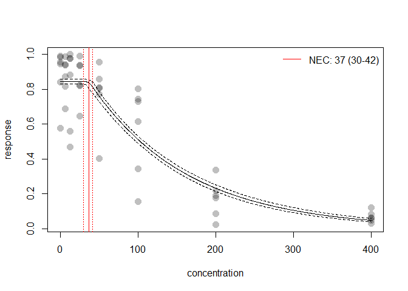

<!-- README.md is generated from README.Rmd. Please edit that file -->

jagsNEC
=======

‘jagsNEC’ is an R package to fit concentration(dose) - response curves
to toxicity data, and derive No-Effect-Concentration (NEC),
No-Significant-Effect-Concentration (NSEC), and Effect-Concentration (of
specified percentage ‘x’, ECx) thresholds from non-linear models fitted
using Bayesian MCMC fitting methods via the R2jags package and jags.

Background
==========

Bayesian model fitting can be difficult to automate across a broad range
of usage cases, particularly with respect to specifying valid initial
values and appropriate priors. This is one reason the use of Bayesian
statistics for NEC estimation (or even ECx estimmation) is not currently
widely adopted across the broader ecotoxicological community, who rarely
have access to specialist statistical expertise. The jagsNEC package
attempts to provide an accessible interface to the R2jags package
specifically for fitting NEC models and other concentration-response
models, with a range of models specified based on the known distribution
of the “concentration” or “dose” variable (the predictor, x) as well as
the “response” (y) variable. The model formula, including priors and the
required init function required to call a jags model are automatically
generated based on information contained in the supplied data. While the
distribution of the x and y variables can be specified directly, jagsNEC
will automatically ‘guess’ the correct distribution to use, based on the
characteristics of the provided data.

This project started with an implementation of the NEC model based on
that described in (Fox 2010). The package has been further generalised
to allow a large range of response variables to be modelled using the
appropriate statistical distribution, and the current implementation
supports gaussian, poisson, binomial, gamma, negbin and beta response
data. We have since also further added a range of alternative NEC model
types, as well as a range of typically used concentration-response
models (such as 4-parameter logistic and weibull models) that have no
NEC ‘step’ function but simply model response as a smooth function of
concentration.

Models can be fit directly using fit.jagsNEC, or alternatively using the
function fit.jagsMANEC it is possible to fit a specific set or all of
the available models. The fit.jagsMANEC function returns a model
weighted estimate of predicted posterior values, based on DIC model
weights. It is also possible to obtain all individual model fits from
the fitted jagsMANECfit model object if required.

An additional endpoint has also been derived using Bayesian posterior
predicted values to estimate the “No-Statistical-Effect-Concentration”
as the concentration at which predicted values for each MCMC chain fall
below a lower percentile bound (defined as sig.val) of the control,
which is assumed to be the lowest treatment (x.var) concentration in the
data. NSEC estimates are currently used to approximate NEC for models
without a specific NEC step parameter (in jagsNEC these have the prefix
ECx in their model name).

Important information on the current package is contained in the jagsNEC
and jagsMANEC helpfiles (see ?jagsNEC).

This package is currently under development. We are keen on any feedback
regarding usage, and especially bug reporting that includes an easy self
contained reproducible example of either unexpected behaviour or example
model fits that fail to converge (have poor chain mixing) or yield other
errors. Such information will hopefully help us towards building a more
robust package. We cannot help troublshoot issues if an easy to run
reproducible example is not supplied.

Installation
============

To install the latest version from github
(<a href="https://github.com/AIMS/NEC-estimation" class="uri">https://github.com/AIMS/NEC-estimation</a>)
use:

    install.packages("remotes")
    remotes::install_github("AIMS/NEC-estimation")

Examples
========

Fitting the NEC3param model using fit.jagsNEC
---------------------------------------------

Here we include some examples showing how to use the package to fit an
NEC model to binomial, proportional, count and continuous response (y)
data. The examples are those used by Gerard Ricardo at:
<a href="https://github.com/gerard-ricardo/NECs/blob/master/NECs" class="uri">https://github.com/gerard-ricardo/NECs/blob/master/NECs</a>.
Here we show how to run the same jags models using the jagsNEC package.

### Binomial data

Where data are a count out of a total (such as the percentage survival
of individuals, for example) y is binomial. First we read in the
binomial example from pastebin, and then plot the “concentration” or x
data, in this case raw.x.

    binom.data <- read.table("https://pastebin.com/raw/zfrUha88", header = TRUE, dec = ",")
    str(binom.data)
    #> 'data.frame':    48 obs. of  3 variables:
    #>  $ raw.x: chr  "0.1" "0.1" "0.1" "0.1" ...
    #>  $ suc  : int  101 106 102 112 58 158 95 91 93 113 ...
    #>  $ tot  : int  175 112 103 114 69 165 109 92 99 138 ...
    binom.data$raw.x <- as.numeric(as.character(binom.data$raw.x))
    range(binom.data$raw.x)
    #> [1]   0.1 400.0
    par(mfrow = c(2, 1))
    hist(binom.data$raw.x)
    hist(binom.data$suc / binom.data$tot)

In this case for x, lowest concentration is 0.1 and the highest is 400.
The data are right skewed and on the continuous scale. This type of
distribution for the x data are common for concentration response
experiments, where the x “concentration” data are the concentration of
contaminants, or dilutions. In general we can model x as gamma. The
current default in jagsNEC is to estimate the appropriate distribution
for both the *y.type* and *x.type* arguments, but it is possible to
supply these arguments directly.

The data are clearly binomial, with the header “suc” - indicating the
number of ‘successes’ in the binomial call, with ‘tot’ clearly
indicating the number of trials.

The main ‘working’ function in jagsNEC is the function fit.jagsNEC,
which calls the other necessary functions and fits the jags model. See
?fit.jagsNEC for more details. We run fit.jagsNEC by supplying *data* -
a data.frame containing the data for the model fitting, here,
binom.data; *x.var* - the name of the column in *data* which contains
the concentration data or ‘x’ data to be used in the NEC model fit, and
*y.var* - the name of the column in *data* which contains the response
or ‘y’ data to be used in the NEC model fit. In our example here, as
this is binomial, we must also supply *trials.var*, which is the name of
the column in *data* which contains the number of trials in the binomial
call.

fit.jagsNEC sill guess the data types for use, although we could specify
*y.type* as “binomial” and *x.type* as “gamma”. This example fits
without specifying either, but trials.var must be supplied.

    set.seed(333)
    out <- fit.jagsNEC(
      data = binom.data,
      x.var = "raw.x",
      y.var = "suc",
      trials.var = "tot"
    )
    #> module glm loaded
    #> Compiling model graph
    #>    Resolving undeclared variables
    #>    Allocating nodes
    #> Graph information:
    #>    Observed stochastic nodes: 48
    #>    Unobserved stochastic nodes: 51
    #>    Total graph size: 685
    #> 
    #> Initializing model
    #> 
    #>   |                                                          |                                                  |   0%  |                                                          |*                                                 |   2%  |                                                          |**                                                |   4%  |                                                          |***                                               |   6%  |                                                          |****                                              |   8%  |                                                          |*****                                             |  10%  |                                                          |******                                            |  12%  |                                                          |*******                                           |  14%  |                                                          |********                                          |  16%  |                                                          |*********                                         |  18%  |                                                          |**********                                        |  20%  |                                                          |***********                                       |  22%  |                                                          |************                                      |  24%  |                                                          |*************                                     |  26%  |                                                          |**************                                    |  28%  |                                                          |***************                                   |  30%  |                                                          |****************                                  |  32%  |                                                          |*****************                                 |  34%  |                                                          |******************                                |  36%  |                                                          |*******************                               |  38%  |                                                          |********************                              |  40%  |                                                          |*********************                             |  42%  |                                                          |**********************                            |  44%  |                                                          |***********************                           |  46%  |                                                          |************************                          |  48%  |                                                          |*************************                         |  50%  |                                                          |**************************                        |  52%  |                                                          |***************************                       |  54%  |                                                          |****************************                      |  56%  |                                                          |*****************************                     |  58%  |                                                          |******************************                    |  60%  |                                                          |*******************************                   |  62%  |                                                          |********************************                  |  64%  |                                                          |*********************************                 |  66%  |                                                          |**********************************                |  68%  |                                                          |***********************************               |  70%  |                                                          |************************************              |  72%  |                                                          |*************************************             |  74%  |                                                          |**************************************            |  76%  |                                                          |***************************************           |  78%  |                                                          |****************************************          |  80%  |                                                          |*****************************************         |  82%  |                                                          |******************************************        |  84%  |                                                          |*******************************************       |  86%  |                                                          |********************************************      |  88%  |                                                          |*********************************************     |  90%  |                                                          |**********************************************    |  92%  |                                                          |***********************************************   |  94%  |                                                          |************************************************  |  96%  |                                                          |************************************************* |  98%  |                                                          |**************************************************| 100%
    #> Response variable suc modelled using a binomial distribution.

The function shows the progress of the jags fit and returns the usual
jags output (with a few other additions to this list). The function
*check.chains* can be used to plot the chains and the chain ACF, so we
can assess mixing and looks for other potential issues with the model
fit. Initially jagsNEC will attempt to use starting values generated by
the init function that we have specified for that type of model fit. It
will run a small number of iterations and then test for good mixing. If
the model fails to fit or the mixing is not very good (among chain
variance is a lot bigger than within chain variance) jagsNEC with try up
to *n.tries* more times to fit the data using the generated *init*
function to try and obtain a successfuly fitted model with good mixing.
If this still fails to yield a successful and/or well mixed model,
jagsNEC will try up to *n.tries* more times using the default initial
values as generated by R2jags. If no model is successfully fit an error
will be returned indicating the model could not be fit succesfully. If a
model is fit but still has poor mixing even after *n.tries* attempts,
the model with the best mixing will be returned, with a warning to
cautiously interpret the results and inspect the chain mixing diagnostic
plot.

    check.chains(out)

In our example, the chains are well mixed and our ACF plot looks good,
so we can go ahead and interpret this model.

The function *plot* can be used to plot the fitted model. Alternatively
you can make your own plot from the data included in the returned list
from the call to fit.jagsNEC. In this example, this could be extracted
using *out$pred.vals*

    par(mfrow = c(1, 1))
    plot(out)

References
==========

Fox, David R. 2010. “A Bayesian approach for determining the no effect
concentration and hazardous concentration in ecotoxicology.”
*Ecotoxicology and Environmental Safety* 73 (2): 123–31.
